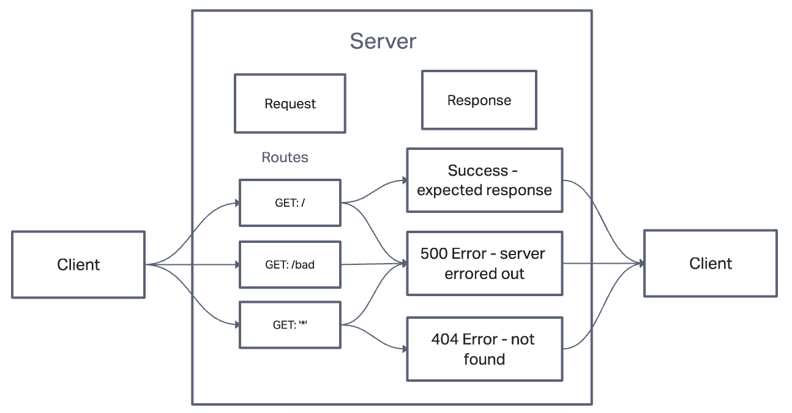

# LAB - Class 01

## Deployment Test

### Author: Branden Ge

### Problem Domain

This lab demonstrates how to do mock testing with

- [Submission PR](https://github.com/brandenge/server-deployment-practice/pull/1)
- [CI/CD GitHub Actions](https://github.com/brandenge/server-deployment-practice/actions)
- [Back-end server url production](https://server-deployment-pract-prod.herokuapp.com/)
- [Back-end server url development](https://server-deployment-pract-dev.herokuapp.com/)

### Setup

1) Install dependencies - npm i
2) Add .env file with port number per .envsample
3) Start the application with npm start or nodemon

`.env` requirements

- `PORT` - Port Number

#### Running the app

- npm start

#### Tests

- Unit Tests: npm run test

UML
(Created with diagrams)

#### UML Diagram

(Created with [InVision](https://www.invisionapp.com/))
