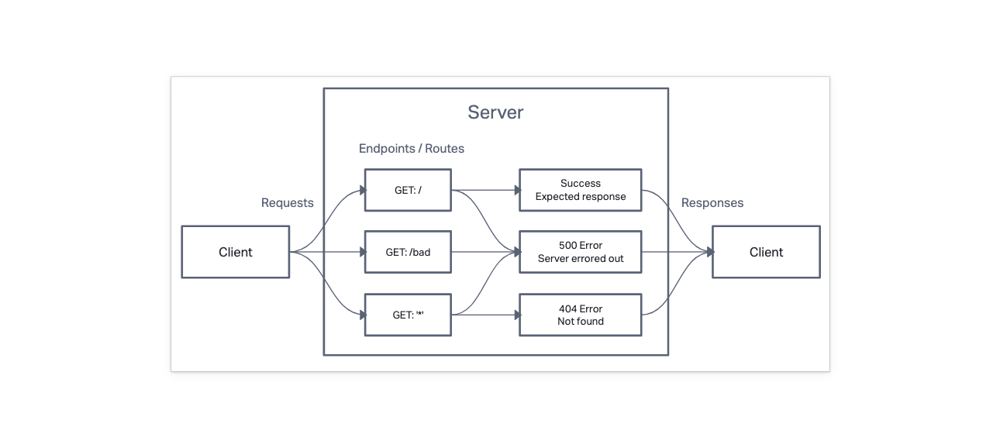

# LAB - Class 01

## Project: Deployment Test

### Author: Branden Ge

### Problem Domain

This lab demonstrates how to do mock testing with an Express server.

- [CI/CD GitHub Actions](https://github.com/brandenge/server-deployment-practice/actions)
- [Back-end server url production](https://server-deployment-pract-prod.herokuapp.com/)
- [Back-end server url development](https://server-deployment-pract-dev.herokuapp.com/)

### Setup

- Add `.env` file with a `PORT` variable set to a port number as shown in the `.envsample`.

#### Running the app

- `npm start` or `nodemon` (if you have nodemon) to start the application.

#### Features / Routes

- GET : `/` - root
- GET : `/bad` - designated bad route that always responds with a 500 Internal Server Error.
- GET : `*` - catch-all route which always responds with a 404 Not Found error.

#### Tests

- `npm test` to run tests

#### UML Diagram

Diagram created with [InVision](https://www.invisionapp.com/)

#### Credits: [Demo code from Ryan Gallaway at Code Fellows](https://github.com/codefellows/seattle-code-javascript-401d48/tree/main/class-01/inclass-demo)
